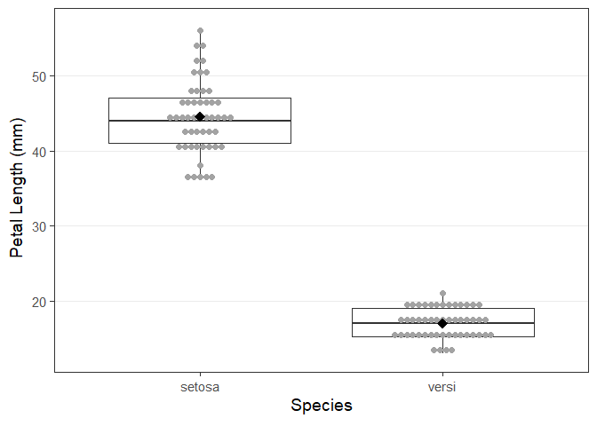

Lab 1 Kerstens and Rodne
================
2024-01-12

## Assignment

Sir Ronald Fisher measured the length and width of two flower parts,
sepals and petals, from two species of iris growing one spring in a
pasture on the Gaspé Peninsula. He wanted to determine how the means of
the distributions of the measurements of these flower parts differed
between the two species, although he did not define what size of
difference would be practically meaningful. Since field botanists often
use ranges of measures of plant characters to distinguish species, he
was also particularly interested in whether these measures could be used
to distinguish the two species in the field.

The data for this assignment consist of sepal and petal lengths and
widths (in mm) measured on 50 individuals each for two species of iris,
*Iris versicolor* and *Iris setosa*. All measurements were taken at the
widest point of the respective flower part. The data are in four
separate files, `setosa_sepal.txt`, `setosa_petal.txt`,
`versi_sepal.txt` and `versi_petal.txt`, representing measurements on
sepals and petals from *I. setosa* and *I. versicolor*, respectively.
Each data set contains three variables: `plant id`, `flower part width`
(mm), and `flower part length` (mm).

# Section I: Analysis

Reading in the data

    ## Warning: package 'tidyverse' was built under R version 4.3.2

    ## Warning: package 'dplyr' was built under R version 4.3.2

    ## Warning: package 'stringr' was built under R version 4.3.2

    ## Warning: package 'forcats' was built under R version 4.3.2

    ## ── Attaching core tidyverse packages ──────────────────────── tidyverse 2.0.0 ──
    ## ✔ dplyr     1.1.4     ✔ readr     2.1.4
    ## ✔ forcats   1.0.0     ✔ stringr   1.5.1
    ## ✔ ggplot2   3.4.4     ✔ tibble    3.2.1
    ## ✔ lubridate 1.9.3     ✔ tidyr     1.3.0
    ## ✔ purrr     1.0.2     
    ## ── Conflicts ────────────────────────────────────────── tidyverse_conflicts() ──
    ## ✖ dplyr::filter() masks stats::filter()
    ## ✖ dplyr::lag()    masks stats::lag()
    ## ℹ Use the conflicted package (<http://conflicted.r-lib.org/>) to force all conflicts to become errors

    ## Warning: package 'here' was built under R version 4.3.2

    ## here() starts at C:/Users/skrod/Documents/GitHub/StatsLabs2024

``` r
setosa_sepal <- read_table(here("Data/setosa_sepal.txt"))
```

    ## 
    ## ── Column specification ────────────────────────────────────────────────────────
    ## cols(
    ##   `"plantid"` = col_double(),
    ##   `"swidth"` = col_double(),
    ##   `"slength"` = col_double()
    ## )

``` r
setosa_petal <- read_table(here("Data/setosa_petal.txt"))
```

    ## 
    ## ── Column specification ────────────────────────────────────────────────────────
    ## cols(
    ##   `"plantid"` = col_double(),
    ##   `"pwidth"` = col_double(),
    ##   `"plength"` = col_double()
    ## )

``` r
versi_sepal <- read_table(here("Data/versi_sepal.txt"))
```

    ## 
    ## ── Column specification ────────────────────────────────────────────────────────
    ## cols(
    ##   `"plantid"` = col_double(),
    ##   `"swidth"` = col_double(),
    ##   `"slength"` = col_double()
    ## )

``` r
versi_petal <- read_table(here("Data/versi_petal.txt"))
```

    ## 
    ## ── Column specification ────────────────────────────────────────────────────────
    ## cols(
    ##   `"plantid"` = col_double(),
    ##   `"pwidth"` = col_double(),
    ##   `"plength"` = col_double()
    ## )

Rename columns

``` r
colnames(setosa_petal) <- c("plantid", "pwidth", "plength")
colnames(setosa_sepal) <- c("plantid", "swidth", "slength")
colnames(versi_petal) <- c("plantid", "pwidth", "plength")
colnames(versi_sepal) <- c("plantid", "swidth", "slength")
```

Combining the petal and sepal measurements for each species into 2
datasets

``` r
setosa <- inner_join(
x = setosa_petal,
y = setosa_sepal,
by = "plantid"
)
versi <- inner_join(
x = versi_petal,
y = versi_sepal,
by = "plantid"
)
```

Naming a separate column in setosa and versi dataframe that
distinguishes the two. This must be done before joining into the single
dataframe (setosa_versi).

``` r
setosa <- setosa %>%
mutate(.,
iris = "setosa"
)
versi <- versi %>%
mutate(.,
iris = "versi"
)
```

Join “setosa” and “versi” into “setosa_versi”. This contains all sepal
and petal measurements for all flowers.

``` r
setosa_versi <- rbind(setosa, versi)
```

Running a summary on the setosa_versi

``` r
summary(setosa_versi)
```

    ##     plantid           pwidth         plength          swidth     
    ##  Min.   :  1.00   Min.   : 3.00   Min.   :13.00   Min.   :18.00  
    ##  1st Qu.: 39.75   1st Qu.: 5.00   1st Qu.:17.00   1st Qu.:27.75  
    ##  Median : 79.50   Median :11.00   Median :28.50   Median :30.50  
    ##  Mean   : 76.00   Mean   :10.56   Mean   :30.77   Mean   :31.80  
    ##  3rd Qu.:110.25   3rd Qu.:16.00   3rd Qu.:44.00   3rd Qu.:36.00  
    ##  Max.   :150.00   Max.   :18.00   Max.   :56.00   Max.   :46.00  
    ##     slength          iris          
    ##  Min.   :40.00   Length:100        
    ##  1st Qu.:52.00   Class :character  
    ##  Median :55.00   Mode  :character  
    ##  Mean   :55.68                     
    ##  3rd Qu.:60.00                     
    ##  Max.   :68.00

``` r
summary(setosa)
```

    ##     plantid           pwidth         plength          swidth     
    ##  Min.   :  7.00   Min.   :13.00   Min.   :36.00   Min.   :23.00  
    ##  1st Qu.: 40.25   1st Qu.:15.00   1st Qu.:41.00   1st Qu.:27.00  
    ##  Median : 77.50   Median :16.00   Median :44.00   Median :28.00  
    ##  Mean   : 75.08   Mean   :15.86   Mean   :44.54   Mean   :28.34  
    ##  3rd Qu.:103.75   3rd Qu.:17.00   3rd Qu.:47.00   3rd Qu.:30.00  
    ##  Max.   :147.00   Max.   :18.00   Max.   :56.00   Max.   :35.00  
    ##     slength         iris          
    ##  Min.   :49.0   Length:50         
    ##  1st Qu.:57.0   Class :character  
    ##  Median :60.0   Mode  :character  
    ##  Mean   :59.3                     
    ##  3rd Qu.:62.0                     
    ##  Max.   :68.0

``` r
summary(versi)
```

    ##     plantid           pwidth        plength          swidth     
    ##  Min.   :  1.00   Min.   :3.00   Min.   :13.00   Min.   :18.00  
    ##  1st Qu.: 36.25   1st Qu.:4.00   1st Qu.:15.25   1st Qu.:31.00  
    ##  Median : 80.50   Median :5.00   Median :17.00   Median :36.00  
    ##  Mean   : 76.92   Mean   :5.26   Mean   :17.00   Mean   :35.26  
    ##  3rd Qu.:113.50   3rd Qu.:6.00   3rd Qu.:19.00   3rd Qu.:40.00  
    ##  Max.   :150.00   Max.   :9.00   Max.   :21.00   Max.   :46.00  
    ##     slength          iris          
    ##  Min.   :40.00   Length:50         
    ##  1st Qu.:49.00   Class :character  
    ##  Median :52.00   Mode  :character  
    ##  Mean   :52.06                     
    ##  3rd Qu.:54.00                     
    ##  Max.   :61.00

Histogram

``` r
qplot(
x = swidth,
fill = iris,
data = setosa_versi,
geom = "density",
alpha = I(0.5) # This syntax removes alpha from the legend
)
```

    ## Warning: `qplot()` was deprecated in ggplot2 3.4.0.
    ## This warning is displayed once every 8 hours.
    ## Call `lifecycle::last_lifecycle_warnings()` to see where this warning was
    ## generated.

<!-- -->
swidth = unequal

``` r
qplot(
x = pwidth,
fill = iris,
data = setosa_versi,
geom = "density",
alpha = I(0.5) # This syntax removes alpha from the legend
)
```

<!-- -->
pwidth = equal

``` r
qplot(
x = plength,
fill = iris,
data = setosa_versi,
geom = "density",
alpha = I(0.5) # This syntax removes alpha from the legend
)
```

<!-- -->
plength = unequal

``` r
qplot(
x = slength,
fill = iris,
data = setosa_versi,
geom = "density",
alpha = I(0.5) # This syntax removes alpha from the legend
)
```

<!-- -->
slength = equal

Exploring the all flower measurements by iris species

petal width

``` r
qplot(
x = iris,
y = pwidth,
data = setosa_versi)
```

<!-- -->

sepal width

``` r
qplot(
x = iris,
y = swidth,
data = setosa_versi)
```

<!-- -->

petal length

``` r
qplot(
x = iris,
y = plength,
data = setosa_versi)
```

<!-- -->

sepal length

``` r
qplot(
x = iris,
y = slength,
data = setosa_versi)
```

<!-- -->

unequal variance assumed option

``` r
(resp_uneq_swidth <- t.test(swidth ~ iris, data = setosa_versi))
```

    ## 
    ##  Welch Two Sample t-test
    ## 
    ## data:  swidth by iris
    ## t = -7.2293, df = 65.689, p-value = 6.473e-10
    ## alternative hypothesis: true difference in means between group setosa and group versi is not equal to 0
    ## 95 percent confidence interval:
    ##  -8.831311 -5.008689
    ## sample estimates:
    ## mean in group setosa  mean in group versi 
    ##                28.34                35.26

``` r
(resp_uneq_plength <- t.test(plength ~ iris, data = setosa_versi))
```

    ## 
    ##  Welch Two Sample t-test
    ## 
    ## data:  plength by iris
    ## t = 37.657, df = 64.967, p-value < 2.2e-16
    ## alternative hypothesis: true difference in means between group setosa and group versi is not equal to 0
    ## 95 percent confidence interval:
    ##  26.07939 29.00061
    ## sample estimates:
    ## mean in group setosa  mean in group versi 
    ##                44.54                17.00

equal variance assumed option

``` r
(resp_eq_pwidth <- t.test(pwidth ~ iris, var.equal = T, data = setosa_versi))
```

    ## 
    ##  Two Sample t-test
    ## 
    ## data:  pwidth by iris
    ## t = 34.325, df = 98, p-value < 2.2e-16
    ## alternative hypothesis: true difference in means between group setosa and group versi is not equal to 0
    ## 95 percent confidence interval:
    ##   9.987178 11.212822
    ## sample estimates:
    ## mean in group setosa  mean in group versi 
    ##                15.86                 5.26

``` r
(resp_eq_slength <- t.test(slength ~ iris, var.equal = T, data = setosa_versi))
```

    ## 
    ##  Two Sample t-test
    ## 
    ## data:  slength by iris
    ## t = 8.5731, df = 98, p-value = 1.497e-13
    ## alternative hypothesis: true difference in means between group setosa and group versi is not equal to 0
    ## 95 percent confidence interval:
    ##  5.564104 8.915896
    ## sample estimates:
    ## mean in group setosa  mean in group versi 
    ##                59.30                52.06

# Section II: Results

1.  Restate Fisher’s two research questions in the order they appear in
    the study description.

A. The questions that Fisher was asking in his study were: 1) If the
means of the distributions for the two iris species sepals and petals
were different? 2) If the measurements of the sepals and petals could be
used to distinguish the two species apart in the field?

2.  What analysis did you use to answer Fisher’s first research
    question? Be specific.

A. We will first check the assumptions to see if we would be using equal
or unequal variance t-tests for finding significant difference between
the two species and their respective petal and sepal sizes.

3.  How did you check the assumptions for the analysis you defined in
    question 2?

A. We made density histogram plots and visually checked for differences
of variance within the measurements for each flower part measurement for
each species.

4.  Write a short paragraph that clearly presents the results for the
    analysis from part 2. Any estimate used for inference should be
    accompanied by a confidence interval for that estimate, and any test
    statistic reported should be accompanied by appropriate information
    on degrees of freedom.

<!-- -->

1.  

<!-- -->

5.  Write a short paragraph to answer Fisher’s second research question.
    Present any additional information you need to support your
    conclusion. You can include tables and graphics, with appropriate
    captions and clear labels, as necessary. Do not include any
    non-graphical output directly from R. Relevant output you want to
    report should be put into a table or written out within the text. Do
    not include any results that are not relevant or not referred to in
    your text. Part of your grade will be on neatness, clarity, and
    appropriateness of presentation; your grade will be reduced if you
    include superfluous output. See below for the grading rubric.

<!-- -->

1.  

### Section III: Short answer (4 points)

Describe and justify the scope of inference based on the description of
Fisher’s data. If you choose to extend the scope of inference, be sure
to justify this choice. If you do not, what gave you pause?
