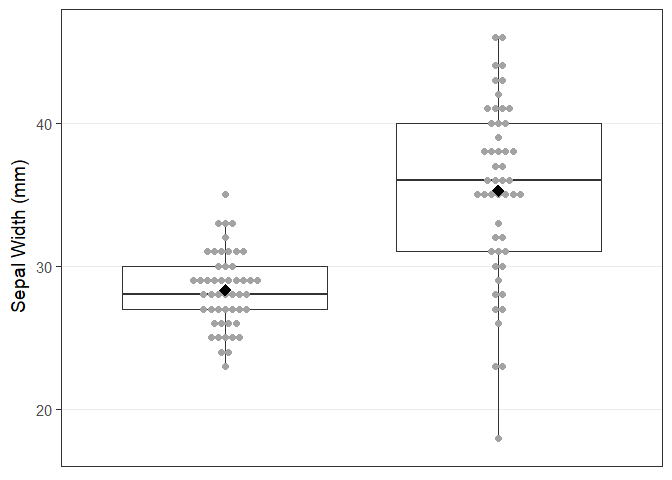
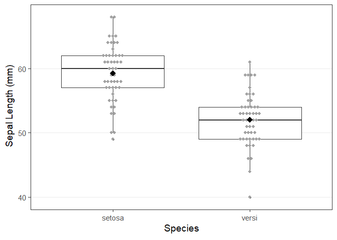

Lab 1 Kerstens and Rodne
================
2024-01-12

## Assignment

Sir Ronald Fisher measured the length and width of two flower parts,
sepals and petals, from two species of iris growing one spring in a
pasture on the Gaspé Peninsula. He wanted to determine how the means of
the distributions of the measurements of these flower parts differed
between the two species, although he did not define what size of
difference would be practically meaningful. Since field botanists often
use ranges of measures of plant characters to distinguish species, he
was also particularly interested in whether these measures could be used
to distinguish the two species in the field.

The data for this assignment consist of sepal and petal lengths and
widths (in mm) measured on 50 individuals each for two species of iris,
*Iris versicolor* and *Iris setosa*. All measurements were taken at the
widest point of the respective flower part. The data are in four
separate files, `setosa_sepal.txt`, `setosa_petal.txt`,
`versi_sepal.txt` and `versi_petal.txt`, representing measurements on
sepals and petals from *I. setosa* and *I. versicolor*, respectively.
Each data set contains three variables: `plant id`, `flower part width`
(mm), and `flower part length` (mm).

# Section I: Analysis

Reading in the data

    ## Warning: package 'tidyverse' was built under R version 4.3.2

    ## Warning: package 'dplyr' was built under R version 4.3.2

    ## Warning: package 'stringr' was built under R version 4.3.2

    ## Warning: package 'forcats' was built under R version 4.3.2

    ## ── Attaching core tidyverse packages ──────────────────────── tidyverse 2.0.0 ──
    ## ✔ dplyr     1.1.4     ✔ readr     2.1.4
    ## ✔ forcats   1.0.0     ✔ stringr   1.5.1
    ## ✔ ggplot2   3.4.4     ✔ tibble    3.2.1
    ## ✔ lubridate 1.9.3     ✔ tidyr     1.3.0
    ## ✔ purrr     1.0.2     
    ## ── Conflicts ────────────────────────────────────────── tidyverse_conflicts() ──
    ## ✖ dplyr::filter() masks stats::filter()
    ## ✖ dplyr::lag()    masks stats::lag()
    ## ℹ Use the conflicted package (<http://conflicted.r-lib.org/>) to force all conflicts to become errors

    ## Warning: package 'here' was built under R version 4.3.2

    ## here() starts at C:/Users/skrod/Documents/GitHub/StatsLabs2024

``` r
setosa_sepal <- read_table(here("Data/setosa_sepal.txt"))
```

    ## 
    ## ── Column specification ────────────────────────────────────────────────────────
    ## cols(
    ##   `"plantid"` = col_double(),
    ##   `"swidth"` = col_double(),
    ##   `"slength"` = col_double()
    ## )

``` r
setosa_petal <- read_table(here("Data/setosa_petal.txt"))
```

    ## 
    ## ── Column specification ────────────────────────────────────────────────────────
    ## cols(
    ##   `"plantid"` = col_double(),
    ##   `"pwidth"` = col_double(),
    ##   `"plength"` = col_double()
    ## )

``` r
versi_sepal <- read_table(here("Data/versi_sepal.txt"))
```

    ## 
    ## ── Column specification ────────────────────────────────────────────────────────
    ## cols(
    ##   `"plantid"` = col_double(),
    ##   `"swidth"` = col_double(),
    ##   `"slength"` = col_double()
    ## )

``` r
versi_petal <- read_table(here("Data/versi_petal.txt"))
```

    ## 
    ## ── Column specification ────────────────────────────────────────────────────────
    ## cols(
    ##   `"plantid"` = col_double(),
    ##   `"pwidth"` = col_double(),
    ##   `"plength"` = col_double()
    ## )

Rename columns

``` r
colnames(setosa_petal) <- c("plantid", "pwidth", "plength")
colnames(setosa_sepal) <- c("plantid", "swidth", "slength")
colnames(versi_petal) <- c("plantid", "pwidth", "plength")
colnames(versi_sepal) <- c("plantid", "swidth", "slength")
```

Combining the petal and sepal measurements for each species into 2
datasets

``` r
setosa <- inner_join(
x = setosa_petal,
y = setosa_sepal,
by = "plantid"
)
versi <- inner_join(
x = versi_petal,
y = versi_sepal,
by = "plantid"
)
```

Naming a separate column in setosa and versi dataframe that
distinguishes the two. This must be done before joining into the single
dataframe (setosa_versi).

``` r
setosa <- setosa %>%
mutate(.,
iris = "setosa"
)
versi <- versi %>%
mutate(.,
iris = "versi"
)
```

Join “setosa” and “versi” into “setosa_versi”. This contains all sepal
and petal measurements for all flowers.

``` r
setosa_versi <- rbind(setosa, versi)
```

Running a summary on the setosa_versi

``` r
summary(setosa$swidth)
```

    ##    Min. 1st Qu.  Median    Mean 3rd Qu.    Max. 
    ##   23.00   27.00   28.00   28.34   30.00   35.00

``` r
summary(versi$swidth)
```

    ##    Min. 1st Qu.  Median    Mean 3rd Qu.    Max. 
    ##   18.00   31.00   36.00   35.26   40.00   46.00

``` r
summary(setosa$pwidth)
```

    ##    Min. 1st Qu.  Median    Mean 3rd Qu.    Max. 
    ##   13.00   15.00   16.00   15.86   17.00   18.00

``` r
summary(versi$pwidth)
```

    ##    Min. 1st Qu.  Median    Mean 3rd Qu.    Max. 
    ##    3.00    4.00    5.00    5.26    6.00    9.00

``` r
summary(setosa$plength)
```

    ##    Min. 1st Qu.  Median    Mean 3rd Qu.    Max. 
    ##   36.00   41.00   44.00   44.54   47.00   56.00

``` r
summary(versi$plength)
```

    ##    Min. 1st Qu.  Median    Mean 3rd Qu.    Max. 
    ##   13.00   15.25   17.00   17.00   19.00   21.00

``` r
summary(setosa$slength)
```

    ##    Min. 1st Qu.  Median    Mean 3rd Qu.    Max. 
    ##    49.0    57.0    60.0    59.3    62.0    68.0

``` r
summary(versi$slength)
```

    ##    Min. 1st Qu.  Median    Mean 3rd Qu.    Max. 
    ##   40.00   49.00   52.00   52.06   54.00   61.00

Histogram

``` r
qplot(
x = swidth,
fill = iris,
data = setosa_versi,
geom = "density",
alpha = I(0.5) # This syntax removes alpha from the legend
)
```

    ## Warning: `qplot()` was deprecated in ggplot2 3.4.0.
    ## This warning is displayed once every 8 hours.
    ## Call `lifecycle::last_lifecycle_warnings()` to see where this warning was
    ## generated.

<!-- -->
swidth = unequal

``` r
qplot(
x = pwidth,
fill = iris,
data = setosa_versi,
geom = "density",
alpha = I(0.5) # This syntax removes alpha from the legend
)
```

<!-- -->
pwidth = equal

``` r
qplot(
x = plength,
fill = iris,
data = setosa_versi,
geom = "density",
alpha = I(0.5) # This syntax removes alpha from the legend
)
```

<!-- -->
plength = unequal

``` r
qplot(
x = slength,
fill = iris,
data = setosa_versi,
geom = "density",
alpha = I(0.5) # This syntax removes alpha from the legend
)
```

<!-- -->
slength = equal

Exploring the all flower measurements by iris species

petal width

``` r
plot1 <- ggplot(setosa_versi, aes(x = iris, y = pwidth)) + # define plot axes
geom_boxplot() + # Add boxplots for each group
geom_dotplot( # Dotplot by group
binaxis = "y",
binwidth = 0.5,
stackdir = "center",
dotsize = .5,
fill = "grey64", colour = "grey64"
) +
stat_summary( # Add means to the plot
fun = mean,
geom= "point", shape = 18, size = 4
) +
theme_bw(base_size = 14) + # Change theme (remove grey background), increase text size
theme(
panel.grid.major.x = element_blank(), # Remove gridlines from x axis
panel.grid.minor.y = element_blank(), # Remove minor gridlines from y
axis.text.x=element_blank(),
axis.ticks.x = element_blank()
) +
labs(
# Change y axis labels with complex units,
y = expression(
paste(
"Petal Width (mm)"
)
),
# remove x axis labels
x = NULL
)
plot1
```

<!-- -->

sepal width

``` r
plot3 <- ggplot(setosa_versi, aes(x = iris, y = swidth)) + # define plot axes
geom_boxplot() + # Add boxplots for each group
geom_dotplot( # Dotplot by group
binaxis = "y",
binwidth = 1,
stackdir = "center",
dotsize = .5,
fill = "grey64", colour = "grey64"
) +
stat_summary( # Add means to the plot
fun = mean,
geom= "point", shape = 18, size = 4
) +
theme_bw(base_size = 14) + # Change theme (remove grey background), increase text size
theme(
panel.grid.major.x = element_blank(), # Remove gridlines from x axis
panel.grid.minor.y = element_blank(), # Remove minor gridlines from y
axis.text.x=element_blank(),
axis.ticks.x = element_blank()
) +
labs(
# Change y axis labels with complex units,
y = expression(
paste(
"Sepal Width (mm)"
)
),
# remove x axis labels
x = NULL
)
plot3
```

<!-- -->

petal length

``` r
plot2 <- ggplot(setosa_versi, aes(x = iris, y = plength)) + # define plot axes
geom_boxplot() + # Add boxplots for each group
geom_dotplot( # Dotplot by group
binaxis = "y",
binwidth = 1.6,
stackdir = "center",
dotsize = .5,
fill = "grey64", colour = "grey64"
) +
stat_summary( # Add means to the plot
fun = mean,
geom= "point", shape = 18, size = 4
) +
theme_bw(base_size = 14) + # Change theme (remove grey background), increase text size
theme(
panel.grid.major.x = element_blank(), # Remove gridlines from x axis
panel.grid.minor.y = element_blank() # Remove minor gridlines from y
) +
labs(
# Change y axis labels with complex units,
y = expression(
paste(
"Petal Length (mm)"
)
),
# x axis labels
x = expression(
paste(
"Species"
)
))
plot2
```

<!-- -->

sepal length

``` r
plot4 <- ggplot(setosa_versi, aes(x = iris, y = slength)) + # define plot axes
geom_boxplot() + # Add boxplots for each group
geom_dotplot( # Dotplot by group
binaxis = "y",
binwidth = 1,
stackdir = "center",
dotsize = .5,
fill = "grey64", colour = "grey64"
) +
stat_summary( # Add means to the plot
fun = mean,
geom= "point", shape = 18, size = 4
) +
theme_bw(base_size = 14) + # Change theme (remove grey background), increase text size
theme(
panel.grid.major.x = element_blank(), # Remove gridlines from x axis
panel.grid.minor.y = element_blank() # Remove minor gridlines from y
) +
labs(
# Change y axis labels with complex units,
y = expression(
paste(
"Sepal Length (mm)"
)
),
# x axis labels
x = expression(
paste(
"Species"
)
))

plot4
```

<!-- -->

Loading the patchwork package for plot visualization

``` r
library(patchwork)
```

    ## Warning: package 'patchwork' was built under R version 4.3.2

Creating the combined petal and sepal plots

``` r
caption_text_1 <- "Figure 1. The observed data points for petal width and length for I. setosa and I. versi. Black diamonds are showing means for the sample population, the dark horizontal line represents the median, the upper and lower lines represent the first and third quantiles, and the small grey dots are the observed data points."
wrapped_caption_1 <- str_wrap(caption_text_1, width = 115)

# making the plot dataframe
combined_plot_petal <- plot1 / plot2 + plot_layout(ncol = 1)

# Plot!
combined_plot_petal  +
  labs(caption = wrapped_caption_1) +
  theme(plot.caption = element_text(size = 8, hjust = 0))
```

<!-- -->

``` r
caption_text_2 <- "Figure 2. The observed data points for sepal width and length for I. setosa and I. versi. Black diamonds are showing means for the sample population, the dark horizontal line represents the median, the upper and lower lines represent the first and third quantiles, and the small grey dots are the observed data points."
wrapped_caption_2 <- str_wrap(caption_text_2, width = 115)

# Plot dataframe
combined_plot_sepal <- plot3 / plot4 + plot_layout(ncol = 1)

# Plot
combined_plot_sepal  +
  labs(caption = wrapped_caption_2) +
  theme(plot.caption = element_text(size = 8, hjust = 0))
```

<!-- -->

unequal variance sepal width assumed option

``` r
(resp_uneq_swidth <- t.test(swidth ~ iris, data = setosa_versi))
```

    ## 
    ##  Welch Two Sample t-test
    ## 
    ## data:  swidth by iris
    ## t = -7.2293, df = 65.689, p-value = 6.473e-10
    ## alternative hypothesis: true difference in means between group setosa and group versi is not equal to 0
    ## 95 percent confidence interval:
    ##  -8.831311 -5.008689
    ## sample estimates:
    ## mean in group setosa  mean in group versi 
    ##                28.34                35.26

unequal variance petal length assumed option

``` r
(resp_uneq_plength <- t.test(plength ~ iris, data = setosa_versi))
```

    ## 
    ##  Welch Two Sample t-test
    ## 
    ## data:  plength by iris
    ## t = 37.657, df = 64.967, p-value < 2.2e-16
    ## alternative hypothesis: true difference in means between group setosa and group versi is not equal to 0
    ## 95 percent confidence interval:
    ##  26.07939 29.00061
    ## sample estimates:
    ## mean in group setosa  mean in group versi 
    ##                44.54                17.00

equal variance petal width assumed option

``` r
(resp_eq_pwidth <- t.test(pwidth ~ iris, var.equal = T, data = setosa_versi))
```

    ## 
    ##  Two Sample t-test
    ## 
    ## data:  pwidth by iris
    ## t = 34.325, df = 98, p-value < 2.2e-16
    ## alternative hypothesis: true difference in means between group setosa and group versi is not equal to 0
    ## 95 percent confidence interval:
    ##   9.987178 11.212822
    ## sample estimates:
    ## mean in group setosa  mean in group versi 
    ##                15.86                 5.26

equal variance sepal length assumed option

``` r
(resp_eq_slength <- t.test(slength ~ iris, var.equal = T, data = setosa_versi))
```

    ## 
    ##  Two Sample t-test
    ## 
    ## data:  slength by iris
    ## t = 8.5731, df = 98, p-value = 1.497e-13
    ## alternative hypothesis: true difference in means between group setosa and group versi is not equal to 0
    ## 95 percent confidence interval:
    ##  5.564104 8.915896
    ## sample estimates:
    ## mean in group setosa  mean in group versi 
    ##                59.30                52.06

# Section II: Results

1.  Restate Fisher’s two research questions in the order they appear in
    the study description.

A. The questions that Fisher was asking in his study were: 1) If the
means of the distributions for the two iris species sepals and petals
were different? 2) If the measurements of the sepals and petals could be
used to distinguish the two species apart in the field?

2.  What analysis did you use to answer Fisher’s first research
    question? Be specific.

A. We will first check the assumptions to see if we would be using equal
two sample t-test or unequal variance Welch’s two sample t-test for
finding both a statistically and biologically significant difference
between the two species and their respective petal and sepal sizes. This
will allow us to answer whether the differences would be detectable in
the field or just from a statistical standpoint.

3.  How did you check the assumptions for the analysis you defined in
    question 2?

A. We made density histogram plots and visually checked for differences
of variance within the measurements for each flower part measurement for
each species. We also checked the summary statistics for all observed
data points for each species and their respective flower parts.

4.  Write a short paragraph that clearly presents the results for the
    analysis from part 2. Any estimate used for inference should be
    accompanied by a confidence interval for that estimate, and any test
    statistic reported should be accompanied by appropriate information
    on degrees of freedom.

A. From the visual inspection of the differences between the two species
and their measureable plant features, we found that petal width and
sepal length had equal variance and petal length and sepal width had
unequal variance. Using summary outputs of the observed data points,
petal length of I. setosa was reported as 44.54 (range: 36 to 56) vs I.
versi mean of 17 (range: 13 to 21). Mean petal width of I. setosa as
15.86 (range: 13 to 18) vs I. versi mean of 5.26 (range: 3 to 9). For
the difference between the measurements of petal length for I. setosa
and I. versi we found an estimated difference of the means as 27.54 (95%
C.I. 26.08 to 29.00; t = 37.66, df = 64.97, p \< 0.001). For the
difference between the measurements of petal width for I. setosa and I.
versi we found an estimated difference of the means as 10.60 (95% C.I.
9.99 to 11.21; t = 34.33, df = 98, p \< 0.001). The summary of the sepal
width observed measurements of I. setosa found a mean of 28.34 (range:
23 to 35) while I. versi had a mean of 35.26 (range: 18 to 46). Sepal
length for I. setosa had a mean of 59.3 (range: 49 to 68) and I. versi
had a mean of 52.06 (range: 40 to 61). The statistical difference of the
means for sepal width between the two species was 6.92 (95% C.I. 8.83 to
5.00; t = -7.23, df = 65.69, p \< 0.001). The statistical difference of
the means for sepal length between the two species was 7.24 (95% C.I.
5.56 to 8.92; t = 8.57, df = 98, p \< 0.001). All estimated differences
in the means between both species for both petal and sepals were
strongly statistically significant.

5.  Write a short paragraph to answer Fisher’s second research question.
    Present any additional information you need to support your
    conclusion. You can include tables and graphics, with appropriate
    captions and clear labels, as necessary. Do not include any
    non-graphical output directly from R. Relevant output you want to
    report should be put into a table or written out within the text. Do
    not include any results that are not relevant or not referred to in
    your text. Part of your grade will be on neatness, clarity, and
    appropriateness of presentation; your grade will be reduced if you
    include superfluous output. See below for the grading rubric.

A. Our analysis reported significant statistical differences between
both sepal and petal widths and lengths for these two Iris species.
However, Fisher wanted to know if these differences were biologically
significant to allow these morphological traits to be used for
identification in the field. Based on our analysis and our observed
measurement ranges, we determined that differences in both petal widths
and length can be reliable fieldmarks for distinguishing these two
species; not only is the difference in means statistically significant,
but there is also no overlap in the range of observed data (Figure 1).
Thus, even if a small I. setosa specimen was compared to a large I.
versi, they could be distinguished in the field. Sepal length and sepal
width on the other hand would not be reliable fieldmarks for
distinguishing these two species. Although the difference in means is
statistically significant, there is a fair amount of overlap in the
range of observed values for both sepal width and sepal length (Figure
2). Therefore, if only sepals were present on a specimen of each Iris
species, and the I. setosa specimen was on the smaller side of the range
and the I. versi specimen was on the larger side of the range, you would
not be able to confidently distinguish them in the field.
<!-- -->
<!-- -->

### Section III: Short answer (4 points)

Describe and justify the scope of inference based on the description of
Fisher’s data. If you choose to extend the scope of inference, be sure
to justify this choice. If you do not, what gave you pause?

A. The scope of inference is limited to pastures in the Gaspé Peninsula,
and may not be reliable for other growing localities where these Iris
species are found because differences in growing conditions could
potentially lead to differences in morphological trait expression other
than what Fisher observed. Additionally, the climate and growing
conditions on the Gaspé Peninsula may have changed since Fisher took
these measurements in the early 20th century, and thus it may be
necessary to re-sample these populations to assess if our findings are
still valid.
